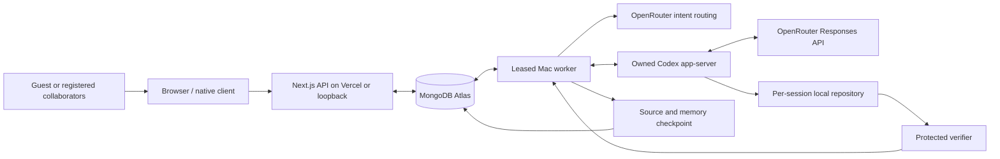

# Converge architecture

Converge coordinates human requirements against one evolving coding workspace. The public Next.js API and local Mac worker share MongoDB Atlas; they do not share a filesystem. Atlas is the durable source of session, membership, intent, and checkpoint state.

## Authentication and sharing

Better Auth uses the same Atlas database through its MongoDB adapter. Anonymous guests receive real server-issued IDs and HttpOnly session cookies. Email/password signup and signin are supported; email verification and password recovery are not configured. The public server requires a stable random `BETTER_AUTH_SECRET` and exact trusted HTTPS origins in `BETTER_AUTH_URL` / `CONVERGE_PUBLIC_URL`.

Every workspace list, snapshot, intent, presence, control, resolution, and SSE route requires an authenticated cookie and membership. Authors derive from that session; request bodies cannot supply a different author. The creator's owner membership is inserted with the workspace in one transaction. Sessions created by older local scripts without memberships remain private and unlisted.

Members can create seven-day invitations containing 256 random bits. Atlas stores only their SHA-256 hashes. A signed-in guest or registered user explicitly joins with the token; the API adds membership idempotently. Workspace IDs alone grant no access. Guest signup/signin transfers memberships, ownership, invitations, and issued Codex credentials to the account while preserving historical intent author IDs and participant labels.

API write origins must match a validated Host origin, with explicit handling for Next.js's loopback hostname normalization. Arbitrary forwarded hostnames, cross-site requests, opaque origins, and DNS rebinding hosts are rejected. Public forwarded IP headers are trusted only on Vercel for authentication rate limiting. SSE checks membership on open and periodically thereafter, emits change notifications, and closes within the serverless request lifetime; the client reconnects and refreshes snapshots.

The external **Connect Codex** integration issues hashed, expiring, revocable bearer credentials scoped to one workspace. Its MCP endpoint allows reading context/changes and reporting progress. It checks current membership and never uses the bearer identity to submit human intent. This is separate from the isolated coding worker, whose external MCP tools are disabled.

## Local execution boundary

`desktop/main.cjs` opens either the configured HTTPS app (`CONVERGE_APP_URL`) or a healthy loopback server. It starts its own Mac worker, supports a second isolated guest-cookie window, and stops only child process groups it owns. The renderer has no Node integration; context isolation, sandboxing, restricted same-origin navigation, and denied permission requests are enabled. The preload exposes narrow window and Codex-connection actions.

Credentials reach server/worker children through an external environment file, never the renderer or bundle. A public Vercel API needs Atlas/auth credentials; the OpenRouter key stays on the worker. All workers attached to the same database form one trusted execution pool. The public service does not run generated code or expose arbitrary host paths.

`lib/codex-bridge.ts` owns a dedicated `codex app-server --listen stdio://` process. JSONL requests have correlated responses, bounded messages, timeouts, pending-call cleanup, and ordered event persistence. The protocol uses `thread/start`, `thread/resume`, `turn/start`, `turn/steer`, and `turn/interrupt`.

A custom OpenRouter provider uses `wire_api = "responses"`. The provider process receives a narrowed environment without Atlas/auth credentials. Agent commands inherit a separate minimal environment. Only the assigned repository is writable; tool network access is disabled, external MCP availability is checked disabled on each thread, and approvals are denied.

The [source fork](https://github.com/Divyesh-Thirukonda/codex-converge) is pinned in `vendor/codex` at `d57fc7e6c298e6191f4cb8e4e096942edc2b4032`. Runtime execution uses the installed compatible binary or `CONVERGE_CODEX_BINARY`; the fork has not been compiled into the demo executable.

## Intent and revision protocol

An intent stores its original text, author, monotonically increasing revision, status, and routing decision. A client request ID deduplicates retries; conflicting reuse fails. Intent, revision, and event commit together.

The router classifies `start`, `extend`, `depend`, `duplicate`, `conflict`, or `parallel`. It sends at most sixteen relevant active records in a bounded structured OpenRouter request; Zod validates the result and parent references. Conservative rules handle the initial intent, exact repeats, explicit contradictions, and unavailable/invalid inference. The persisted decision reports its actual source.

The plan retains source-attributed requirements. Compatible amendments steer the active turn with its expected ID; an acknowledged steer increments the metric. If the turn has already completed, the next turn continues the same thread. Conflicts interrupt execution until a person explicitly keeps or replaces the prior direction. Original requests remain in history.

Completion checks the current revision, queued/blocked intents, pause state, and unexpired worker lease transactionally. Stale verification cannot fulfill newer requirements. A lease lasts thirty seconds, renews every seven seconds, and fences state, metrics, and checkpoint writes. A worker runs at most two sessions concurrently and closes its Codex bridge when its lease is lost.

## Atlas state and limits

| Collections | Purpose |
| --- | --- |
| `cv_auth_*` | Better Auth users, sessions, accounts, verifications, and auth rate limits |
| `cv_memberships`, `cv_participants` | Access rights and attributed participant display data |
| `cv_invites`, `cv_agent_tokens` | Hashed invitation and scoped Codex credentials |
| `cv_sessions`, `cv_intents` | Revision, plan, lease, metrics, original requirements and deduplication |
| `cv_events`, `cv_trajectory`, `cv_external_trajectory` | Ordered display events, redacted final Codex items, and external progress |
| `cv_checkpoints`, `cv_source_checkpoints` | Memory evidence and immutable source manifests |
| `cv_token_usage` | Per-thread cursor preventing duplicate cumulative token accounting |
| `cv_budgets`, `cv_api_limits` | Atomic model admission and per-user/session API counters |
| `cv_presence`, `cv_workers` | Expiring participant presence and worker heartbeat |

There is no in-memory persistence fallback. Atlas must support transactions and indexes. Consistent snapshots return the latest 100 display events and eight checkpoints; the archive remains durable. Final app-server items and lifecycle notifications are stored, not every token delta. Known credentials and token patterns are redacted before event/trajectory persistence.

Hourly admission limits are **30 per session, 60 per owner, and 100 globally**. The worker derives the owner from the stored session and reserves every applicable counter in one transaction before routing or starting a turn. A denied scope charges none of the others. Counters expire through TTL indexes. Legacy ownerless sessions still consume session/global limits. These count admitted routing/turn operations, including conservative routing attempts; one Codex turn may issue several provider requests. They are not a token or spending guarantee.

Auth/API limits additionally bound guest creation, signin attempts, workspace creation, intent submission, sharing, joining, reads, retries, and SSE opens. Guests have three owned workspaces and thirty submitted intents per day; registered users have larger limits. A workspace has at most twenty members and sixty-four active requirements. These are demo abuse controls, not a substitute for production account verification and infrastructure monitoring.

## Memory, recovery, and verification

`lib/context.ts` caps active context at 16,000 characters. Every active requirement and attribution is mandatory. If mandatory state cannot fit, execution stops explicitly. Remaining room holds selected checkpoint excerpts and recent events with source IDs and omission counts. Historical summaries are evidence, not authority over live requirements.

`lib/source-checkpoint.ts` captures `src/`, `tests/`, `package.json`, and `README.md`. Paths, symlinks, UTF-8, case collisions, hashes, forty-file and one-megabyte limits are checked. Unsupported source files or detected credentials fail capture. Source bundle, memory metadata, and session pointer commit in one lease-fenced transaction. Restore verifies hashes and replaces the controlled trees, including deletions, with staged rollback. Uncheckpointed edits are not durable across machines. An unavailable Codex thread can be replaced using restored source and attributed context.

The coding workspace starts from `fixtures/stripe-store` under `.converge/workspaces/<session-id>` or `CONVERGE_DATA_DIR`. The trusted verifier lives outside that writable repository and runs through a read-only, network-disabled Codex sandbox. Generated code executes in a time/output/memory-bounded child with restricted filesystem permissions; trusted assertions stay in the parent and validate controlled fixture calls and returned products. Generated stdout or self-written tests cannot assert successful completion.

Checks cover the fixture's active catalog, pagination, names, dollar prices, timestamps, and requested badges. The worker accepts only the exact expected check schema and intent references. Unsupported criteria fail for review; up to three repair attempts are allowed. Source diffs and independently checked products populate the UI. This does not connect live Stripe payments or certify arbitrary applications.

## Validation status

Local tests cover real Atlas guest signup/signin linking, authorization failures, spoofed authors, invitation sharing, origin checks, source restoration, transport isolation, and protected verification. Budget contention tests use isolated counter keys and never consume live model capacity. The public HTTPS deployment has passed a separate two-cookie guest/invite/isolation and scoped MCP context/progress smoke test. Long-duration or billion-token endurance has not been established.

Protocol references: [Codex app-server](https://learn.chatgpt.com/docs/app-server), [OpenRouter Responses API](https://openrouter.ai/docs/api/api-reference/responses/create-responses), [Better Auth anonymous accounts](https://www.better-auth.com/docs/plugins/anonymous), [MongoDB Atlas](https://www.mongodb.com/docs/atlas/).
