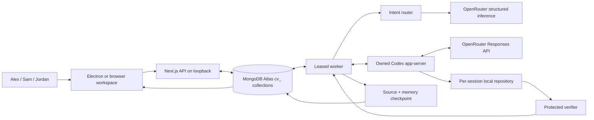

# Converge architecture

Converge coordinates multiple human requests against one evolving local coding workspace. MongoDB Atlas is the source of durable session state. A worker owns execution through a renewable lease, routes new requests, steers Codex, verifies results, and checkpoints both intent memory and source files.

## Execution path

`components/workspace.tsx` reads real session snapshots, listens for SSE `change` notifications, and also polls every two seconds. Human intent cards preserve author attribution. The plan, changes, checks, preview, and memory panels derive from stored state; no canned successful trajectory is inserted.

## Native client and Codex boundary

`desktop/main.cjs` starts or reuses a healthy loopback Converge server, starts its own worker, and permits at most two application windows. The collaborator action preserves the session query parameter while switching Alex to Sam or Sam to Alex. The preload bridge exposes only desktop identity and this window action. The renderer has no Node integration; context isolation, the Electron sandbox, same-origin navigation restrictions, and denied permission requests remain enabled.

The app launcher loads credentials only into server/worker children through an external environment file. The packaged client contains the standalone Next.js runtime, bundled worker, fixture, and trusted verifier, while local workspaces and credentials remain external. It shuts down only process groups it created.

`lib/codex-bridge.ts` owns a dedicated `codex app-server --listen stdio://` process. It does not attach to the user's existing app-server daemon. Its JSONL transport correlates requests, enforces message limits, handles terminal-notification races, rejects pending calls on process failure, and drains ordered event persistence before durable completion is reported.

The bridge uses `thread/start`, `thread/resume`, `turn/start`, `turn/steer`, and `turn/interrupt`. The custom provider points to OpenRouter with `wire_api = "responses"`; no OpenAI credits are assumed. A narrowed environment passes the OpenRouter key to the provider process without exporting Atlas credentials. Agent commands inherit a separate minimal environment. The assigned workspace is writable; network access for agent tools is disabled. External MCP tools are explicitly disabled and their unavailable state is verified on each assigned thread. Approval requests are denied.

The source fork is [codex-converge](https://github.com/Divyesh-Thirukonda/codex-converge), pinned in `vendor/codex` at `d57fc7e6c298e6191f4cb8e4e096942edc2b4032`. The current executable comes from the installed compatible runtime or `CONVERGE_CODEX_BINARY`. This project has not rebuilt that fork into the running demo binary.

## Intent and revision protocol

Each intent has an author, monotonically increasing session revision, original text, status, and optional routing decision. Submissions use a client request ID so retries do not create duplicate records; reuse with different content is rejected. Transactions record the intent, session revision, and event together.

The router classifies an incoming request as `start`, `extend`, `depend`, `duplicate`, `conflict`, or `parallel`. It can send up to sixteen relevant active records to OpenRouter in a bounded structured-output request. Zod checks the result, relationship shape, and parent IDs. A conservative local classifier is used for the initial request, missing/unavailable inference, invalid responses, and explicit contradictions or exact repeats that must remain preserved. The stored `source` reports which route was used.

The shared plan retains a source-attributed step and acceptance constraints for each active request. Authors have equal authority. A conflicting intent becomes blocked; neither recency nor a model classification silently supersedes another author's requirement. A person chooses `keep-existing` or `replace-existing`, and the store records the resolution. Duplicate intents remain traceable but do not need a new coding turn after the current work is processed.

The worker polls an active turn for revision changes. Compatible changes rebuild the context and call `turn/steer` with the expected active turn ID. The steering metric increments after acknowledgement. If a turn completes before the amendment can be delivered, the latest revision continues in the same thread on another turn. A conflict or pause request interrupts the turn and checkpoints the session. Completion is transactional and checks the current revision, pending/blocked intents, pause state, and worker lease; stale verification cannot fulfill a later revision.

## Durable state in Atlas

There is no in-memory database fallback. The configured Atlas database must support transactions and collection/index creation. The existing environment can retain the database name `aegis`; Converge uses its own collection prefix.

| Collection | Stored role |
| --- | --- |
| `cv_sessions` | Current revision, shared plan, state, metrics, artifact, Codex thread, worker lease, source checkpoint pointer |
| `cv_intents` | Attributed original requests, routing relationships, statuses, resolutions, request deduplication |
| `cv_events` | Ordered human-readable trajectory with intent references |
| `cv_trajectory` | Redacted final app-server items and lifecycle notifications, split into bounded chunks |
| `cv_checkpoints` | Compact memory, decisions, intent IDs, and source event IDs |
| `cv_source_checkpoints` | Immutable source manifests with content hashes and memory metadata hash |
| `cv_token_usage` | Per-thread accounting cursor to avoid counting cumulative usage twice |
| `cv_budgets` | Hourly global model-operation counter |
| `cv_presence` | Temporary persona presence; TTL expiration |
| `cv_workers` | Worker liveness heartbeat; TTL expiration |

Unique indexes enforce one intent per session revision and one event per session sequence. Supporting indexes cover recent sessions, checkpoints, and trajectories. Snapshot reads use transactions and return the latest 100 display events and eight checkpoints; older records remain in Atlas. The archival trajectory skips token/text deltas and legacy duplicate event streams, preserving final items and lifecycle events rather than every streaming fragment. Redaction removes known secrets and credential patterns before storing event/trajectory text.

A session lease lasts thirty seconds and is renewed every seven seconds. A worker runs up to two sessions concurrently and closes its Codex bridge if it loses a lease. State/metrics updates and checkpoint commits require the current lease. The current model budget permits 100 routed-intent/started-turn claims per hour across the database; it is an operation guard, not a guarantee about dollar cost or generated token totals.

## Context compaction and recovery

`lib/context.ts` builds a default maximum of 16,000 characters. Mandatory working state includes every active intent, original text, author, revision, acceptance criteria, relationship, and plan. At most 64 active requests are admitted. If mandatory state exceeds the character budget, the harness fails explicitly; it never silently truncates an active requirement to make room for history.

Remaining capacity can include up to three checkpoint excerpts and 32 recent events. The selection is deterministic, records source IDs and omission counts, and treats historical text as evidence rather than instructions. Checkpoints reference their source intents/events; a summary cannot override live requirements. This limits per-turn working context while retaining the broader archive. It is an engineering mechanism for longer sessions, not evidence of billion-token endurance.

`lib/source-checkpoint.ts` captures the controlled source surface: `src/`, `tests/`, `package.json`, and `README.md`. It validates allowed paths, UTF-8 content, case collisions, symlinks, per-file checksums, a maximum of forty files, and a combined one-megabyte content limit. Unsupported files within that surface fail capture instead of silently disappearing. Source containing detected credentials is rejected.

The source bundle, memory checkpoint, and session's source pointer commit in one Atlas transaction under the lease. Reusing an immutable checkpoint ID with different source or metadata is rejected. Recovery follows the committed pointer and checks the bundle hash. A staged restore replaces the controlled paths, including deletions, with rollback if installation fails. A newly prepared local workspace can restore the selected bundle from Atlas. If its previous Codex thread is unavailable, the worker creates a fresh thread using restored source, active requirements, and checkpoint evidence. Recovery is to the latest committed checkpoint; uncheckpointed local edits are not a cross-machine durability guarantee.

## Protected verification

The coding agent edits a copy of `fixtures/stripe-store` in `.converge/workspaces/<session-id>` (or `CONVERGE_DATA_DIR`). It can write tests and run them, but its own test output cannot decide completion.

`scripts/verify-workspace.mjs` is held outside the writable repository. The harness invokes it through a read-only, network-disabled Codex sandbox. Trusted assertions execute in a parent process while generated source runs in a time/output/memory-bounded child with Node filesystem permissions and no child-process permission. A controlled Stripe-compatible client supplies two pages containing an inactive product and shuffled creation times. The parent checks the active catalog, pagination cursor, names, dollar prices, timestamps, and the required badge set. The worker validates the expected check names and intent references before accepting the verifier result.

Checks are grounded in the supported storefront requirements. An unrecognized acceptance criterion produces an explicit failed review check. Up to three repair attempts are allowed; errors, provider failures, and remaining verification failures are surfaced with their saved context. Actual Git diffs and verified products become the UI artifact. No live Stripe API or payment flow is involved.

## API surface

| Method | Path | Purpose |
| --- | --- | --- |
| `GET` | `/api/health` | Actual Atlas connection state and provider configuration |
| `GET`, `POST` | `/api/sessions` | List or create sessions |
| `GET` | `/api/sessions/:id` | Consistent snapshot with worker and storage state |
| `GET` | `/api/sessions/:id/stream` | SSE change notifications prompting a fresh snapshot |
| `POST` | `/api/sessions/:id/intents` | Submit attributed text and a client request ID |
| `POST` | `/api/sessions/:id/resolve` | Keep or replace a conflicting requirement |
| `POST` | `/api/sessions/:id/control` | Pause, resume, or retry |
| `POST` | `/api/sessions/:id/presence` | Refresh a local persona's presence |

This is a local Mac prototype. Personas are not authenticated identities, local session links are not an authorization system, and no cloud execution or remote multi-tenant deployment is implemented. Broader workloads require additional acceptance verifiers, authenticated access, operational limits, and endurance validation before making production-scale claims.

## Protocol references

- [Codex app-server protocol](https://learn.chatgpt.com/docs/app-server)
- [MongoDB Atlas agentic control center architecture](https://www.mongodb.com/docs/atlas/architecture/current/solutions-library/agentic-control-center/)
- [OpenRouter Responses API](https://openrouter.ai/docs/api/api-reference/responses/create-responses)

The custom harness uses the MongoDB driver directly; it does not claim to use a separate managed agent-memory service. Multiple local clients can share the same Atlas session ledger, but authenticated remote access and cloud worker deployment have not been implemented or verified.
